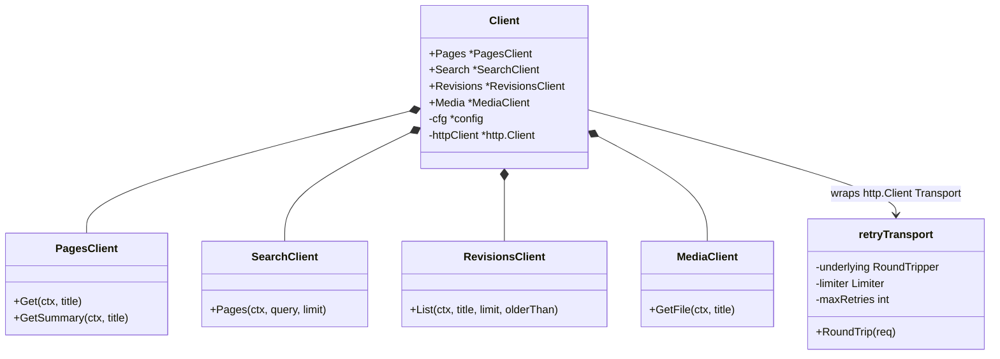
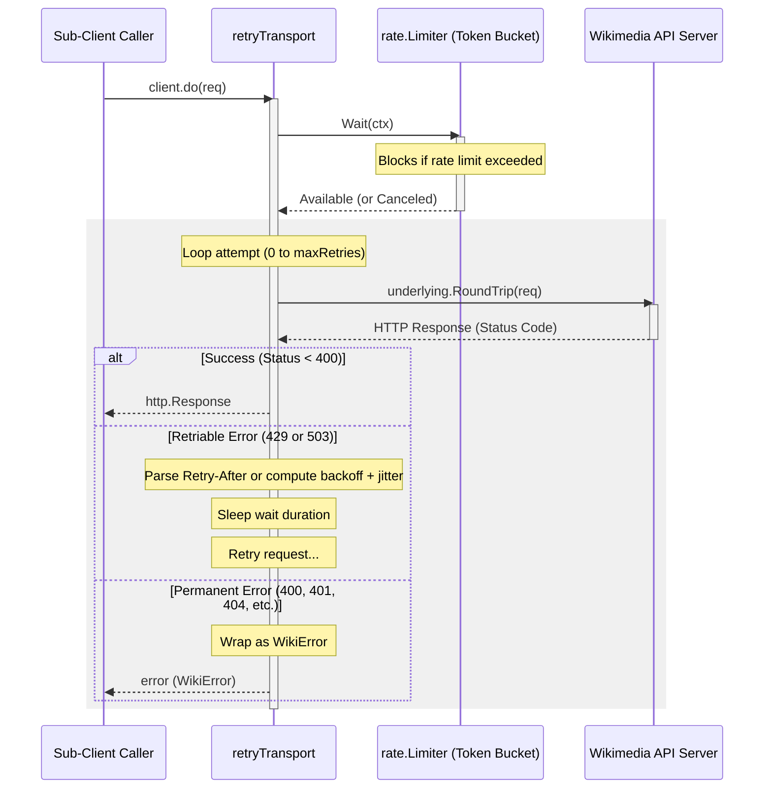

# wikigo Developer & API Documentation

Welcome to the comprehensive documentation for the `wikigo` Go SDK. This document covers the architecture, internal mechanics, API references, and development guidelines for this production-quality Wikimedia REST API client.

---

## 1. Architecture Overview

The `wikigo` SDK is designed to be idiomatic, extensible, and robust. It uses the **Decorator Pattern** on Go's `http.RoundTripper` to manage cross-cutting concerns (rate limiting, retries, and HTTP error wrapping) transparently beneath the standard `http.Client`.

### Component Diagram



---

## 2. Package Architecture

The SDK is divided into three packages to separate public domains, internal logic, and data models:

| Package Path | Purpose |
| :--- | :--- |
| `github.com/saluja-ji/wikigo` | Main entrypoint, contains constructor, functional options, resource sub-clients, and `retryTransport`. |
| `github.com/saluja-ji/wikigo/models` | Strongly-typed structs representing Wikimedia REST API JSON responses. No `map[string]interface{}`. |
| `github.com/saluja-ji/wikigo/errors` | Sentinel error definitions and the custom wrapped `WikiError` struct. |

---

## 3. Internal Mechanics

### Request Execution Flow
Every request initiated by a sub-client passes through the custom `retryTransport` RoundTripper. Below is the sequence of execution:



### Rate Limiting
The SDK integrates `golang.org/x/time/rate` to implement a token bucket rate limiter. It is fully compliant with the Wikimedia API policy which limits clients to safe requests per second. The limiter respects context cancellations during blocking waits.

### Backoff and Jitter Calculation
When retrying transient errors (`HTTP 429` and `503`), the SDK uses exponential backoff:

$$\text{base\_backoff} = 1\text{s} \times 2^{\text{attempt}}$$

A randomized jitter of $\pm20\%$ is added:

$$\text{jitter} \in [0.8, 1.2]$$
$$\text{delay} = \text{base\_backoff} \times \text{jitter}$$

To prevent overflow on very large retry limits, the bit shift is capped at $2^{30}$, and the base backoff is capped at a maximum of `30 * time.Second`.

---

## 4. API Reference & Code Examples

### Custom Error Types (`errors` package)

Errors returned from the API are mapped to one of the following sentinel values wrapped in a `WikiError`:

```go
var (
	ErrNotFound      = errors.New("resource not found")         // Status 404
	ErrRateLimited   = errors.New("rate limit exceeded")        // Status 429
	ErrUnauthorized  = errors.New("unauthorized access")       // Status 401 & 403
	ErrBadRequest    = errors.New("bad request")                // Status 400
	ErrServerError   = errors.New("wikimedia server error")     // Status 5xx
)
```

Example usage to detect a `404 Not Found` error:

```go
page, err := client.Pages.Get(ctx, "NonExistentPage")
if err != nil {
	if errors.Is(err, wikierrors.ErrNotFound) {
		fmt.Println("This article does not exist!")
	}
	
	// Access the raw status code
	var wikiErr *wikierrors.WikiError
	if errors.As(err, &wikiErr) {
		fmt.Printf("HTTP Status Code: %d, Response: %s\n", wikiErr.StatusCode, wikiErr.Message)
	}
}
```

---

### Client Options

Options are applied during client construction:

```go
client := wikigo.NewClient(
    wikigo.WithLanguage("de"),                       // Default: "en"
    wikigo.WithProject("wiktionary"),                 // Default: "wikipedia"
    wikigo.WithTimeout(10 * time.Second),             // Default: 30s
    wikigo.WithRateLimit(rate.Limit(5), 5),           // Default: 15 req/s
    wikigo.WithMaxRetries(5),                         // Default: 3
    wikigo.WithUserAgent("MyBot/1.0 (contact@me.org)"), // Default: SDK default UA
)
```

---

### Pagination (Revisions Sub-Client)

The Revisions sub-client does **not** auto-paginate, as doing so might hide the underlying latency and API request count from the caller. Instead, it exposes a `Continue` token:

```go
limit := 10
olderThan := ""

for {
    history, err := client.Revisions.List(ctx, "Earth", limit, olderThan)
    if err != nil {
        log.Fatalf("failed to fetch history: %v", err)
    }

    for _, rev := range history.Revisions {
        fmt.Printf("Revision #%d: size %d\n", rev.ID, rev.Size)
    }

    // Stop if there is no next cursor
    if history.Continue == "" {
        break
    }
    
    // Set the cursor for the next batch
    olderThan = history.Continue
}
```

---

### Custom HTTP Client Injection

If your application routes all outbound requests through a custom proxy or needs custom TLS configurations, you can inject a custom `*http.Client`. The SDK wraps your client's custom transport transparently:

```go
customHTTP := &http.Client{
    Transport: &http.Transport{
        Proxy: http.ProxyURL(proxyURL),
    },
}

client := wikigo.NewClient(
    wikigo.WithHTTPClient(customHTTP),
)
```

---

## 5. Testing Strategy

`wikigo` features a strict **zero network dependencies** policy for unit tests. All tests run deterministically against mock servers.

1. **`transport_test.go`**: Mocks server responses to test the rate limiter waiting logic, exponential backoffs, 503 retry successes, max retries exhaustion, and strict `Retry-After` header delays (supporting both delay seconds and HTTP-date strings).
2. **`client_test.go`**: Sets up specific routes using `httptest.NewServer` to test correct query parameters serialization, path URL escaping (e.g. replacing spaces with underscores), JSON parsing for all data models, and error conversions.

To run the full suite:
```bash
go test -v ./...
```
